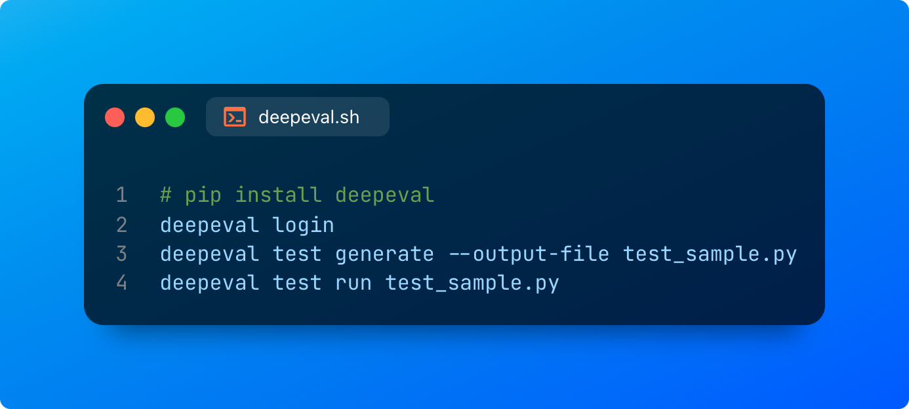
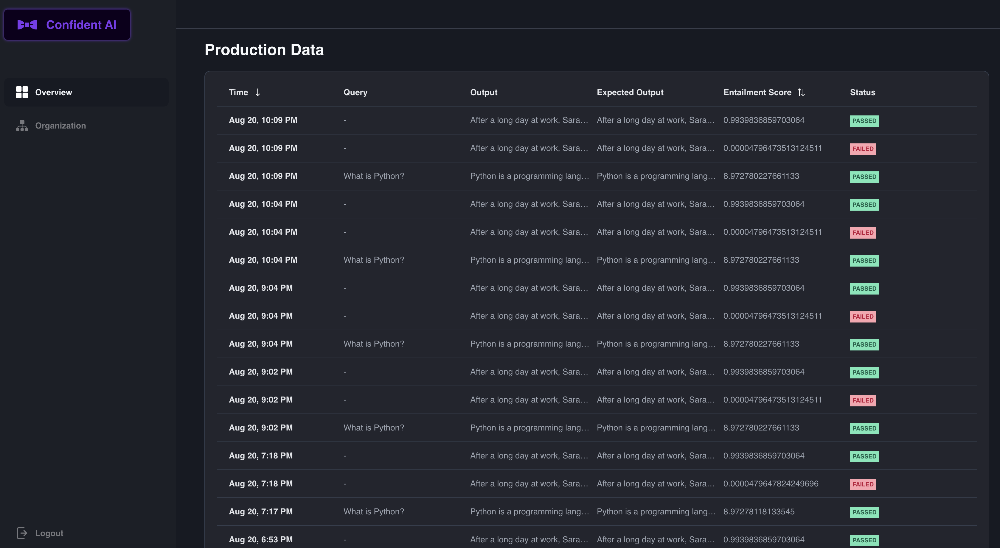

<div style="text-align: center;">
    <h1>👩‍⚖️ DeepEval</h1>
</div>

<div style="width: 700px; height: 200px; overflow: hidden;">
  
</div>
<br>

<div align="center">

[](https://discord.gg/a3K9c8GRGt)

[](https://badge.fury.io/py/deepeval)<a target="_blank" href="https://colab.research.google.com/drive/1HxPWwNdNnq6cLkMh4NQ_pAAPgd8vlOly?usp=sharing">
  <!--  -->
</a> [](https://twitter.com/colabdog)
</div>

# Unit Testing For LLMs

DeepEval provides metrics on different aspects when evaluating an LLM response to ensure that answers are relevant, consistent, unbiased, non-toxic. These can easily fit in nicely with a CI/CD pipeline that allows ML engineers to quickly evaluate and check that when they improve their LLM application that their LLM application is performing well.

DeepEval offers a Python-friendly approach to conduct offline evaluations, ensuring your pipelines are ready for production. It's like having a "Pytest for your pipelines", making the process of productionizing and evaluating your pipelines as straightforward as passing all tests.

DeepEval's Web UI allows engineers to then analyze and view their evaluation.

# Features

- Tests for answer relevancy, factual consistency, toxicness, bias
- Web UI for viewing tests, implementations, comparisons
- Auto-evaluation through synthetic query-answer creation

# Installation

```
pip install deepeval
```

For a quick start guide, watch this Youtube video: [Get started in under 1 minute](http://www.youtube.com/watch?v=05uoNgZpnzM)

# QuickStart



## Running from a command-line interface

```bash
# Optional - if you want a web UI
deepeval login
# Run the API key and implementation name
deepeval login --api-key $API_KEY --implementation-name "sample"
# Generate a sample test file
deepeval test generate --output-file test_sample.py
# Run this test
deepeval test run test_sample.py
```

```bash
deepeval test run tests/test_sample.py
```

## Individual Test Cases

To start logging, get your API key from [https://app.confident-ai.com](https://app.confident-ai.com)

```python
# test_example.py
import os
import openai
from deepeval.metrics.answer_relevancy import AnswerRelevancyMetric
from deepeval.test_case import LLMTestCase
from deepeval.run_test import assert_test

openai.api_key = "sk-XXX"


# Write a sample ChatGPT function
def generate_chatgpt_output(query: str):
    response = openai.ChatCompletion.create(
        model="gpt-3.5-turbo",
        messages=[
            {"role": "system", "content": "You are a helpful assistant."},
            {
                "role": "assistant",
                "content": "The customer success phone line is 1200-231-231 and the customer success state is in Austin.",
            },
            {"role": "user", "content": query},
        ],
    )
    expected_output = response.choices[0].message.content
    return expected_output


def test_llm_output():
    query = "What is the customer success phone line?"
    expected_output = "Our customer success phone line is 1200-231-231."
    test_case = LLMTestCase(query=query, expected_output=expected_output)
    metric = AnswerRelevancyMetric()
    assert_test(test_case, metrics=[metric])
```

After setting up, you can call pytest

```bash
deepeval test run test_example.py

# Output
Running tests ... ✅
```

After running tests, you can view your dashboard on [https://app.confident-ai.com](https://app.confident-ai.com)

## Setting up metrics

### Setting up custom metrics

To define a custom metric, you need to define the `measure` and `is_successful` property.

```python
from deepeval.test_case import LLMTestCase
from deepeval.metrics.metric import Metric
from deepeval.run_test import assert_test

# Run this test
class LengthMetric(Metric):
    """This metric checks if the output is more than 3 letters"""

    def __init__(self, minimum_length: int = 3):
        self.minimum_length = minimum_length

    def measure(self, test_case: LLMTestCase):
        # sends to server
        text = test_case.output
        score = len(text)
        self.success = bool(score > self.minimum_length)
        return score

    def is_successful(self):
        return self.success

    @property
    def __name__(self):
        return "Length"

def test_length_metric():
    metric = LengthMetric()
    test_case = LLMTestCase(
        output="This is a long sentence that is more than 3 letters"
    )
    assert_test(test_case, [metric])
```

## Integration with LangChain

DeepEval integrates with common frameworks such as Langchain and lLamaIndex.

# Synthetic Query Generation


Synthetic queries allow for quick evaluation of queries related to your prompts. We provide a variety of example queries to help developers get started.

# Dashboard

Set up a simple dashboard in just 1 line of code. Learn more about this in our [documentation](https://docs.confident-ai.com/docs/quickstart/dashboard-app).



## About DeepEval

DeepEval simplifies the testing process for Language Learning Model (LLM) applications such as Retrieval Augmented Generation (RAG). Our goal is to make writing tests as simple as writing unit tests in Python.

In the Machine Learning (ML) domain, feedback is often provided as raw evaluation loss, which is a departure from the structured feedback typically seen in software development.

With the increasing deployment of agents, LLMs, and AI, there is a need for a tool that provides the same familiar abstractions and tools found in general software development to ML engineers. The goal is to enable a faster feedback loop to speed up iterative improvements.

DeepEval is a tool designed to simplify and streamline LLM testing. Our aim is to change the way we write, run, automate, and manage our LLM tests.

Welcome to DeepEval.

## 🤝 Connect with us

For onboarding, demos, or inquiries about our roadmap, please schedule a session with us: https://calendly.com/d/z7h-75h-6dz/confident-ai-demo

We recommend starting with our documentation: https://docs.confident-ai.com/docs/

Join our community on Discord: https://discord.gg/a3K9c8GRGt


# Authors

Built by the Confident AI Team. For any questions/business enquiries - please contact jacky@confident-ai.com

# Citation

```
@misc{deepeval,
  author = {Jacky Wong},
  title = {DeepEval: Framework to unit test LLMS},
  year = {2023},
  publisher = {GitHub},
  journal = {GitHub repository},
  howpublished = {\url{https://github.com/confident-ai/deepeval}},
}
```

# Contributors

<!-- ALL-CONTRIBUTORS-LIST:START - Do not remove or modify this section -->
<!-- prettier-ignore-start -->
<!-- markdownlint-disable -->

<!-- markdownlint-restore -->
<!-- prettier-ignore-end -->

<!-- ALL-CONTRIBUTORS-LIST:END -->

<a href="https://github.com/confident-ai/deepeval/graphs/contributors">
  
</a>

