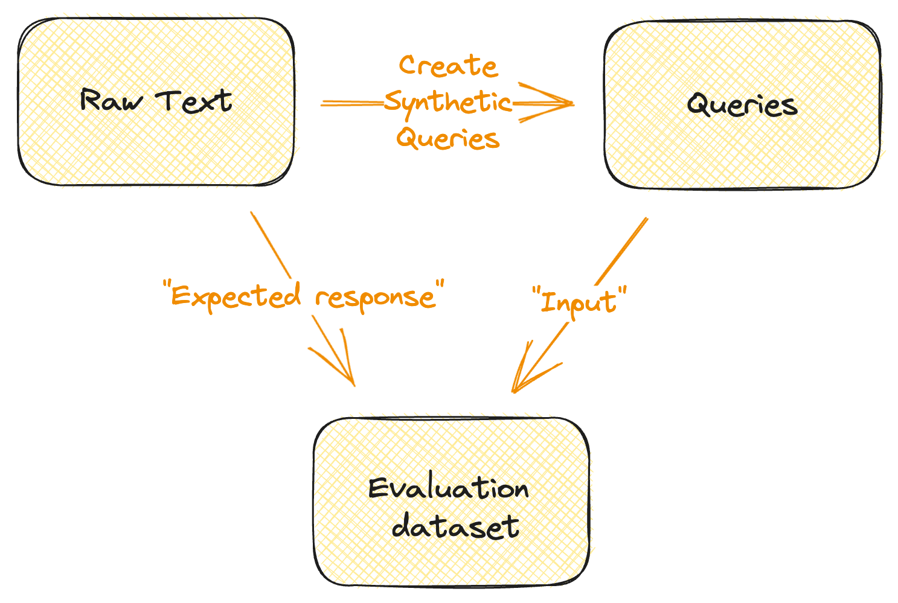

# Create Synthetic Data

## Problem synthetic data creation solves

- When there isn't much data or any data to start with for evaluating langchain pipelines
- When getting an eyeball check of current performance is done very quickly



Generating synthetic queries allows you to quickly evaluate the queries related to your prompts.
We help developers get up and running with example queries from just raw text.

```python
# Loads the synthetic query model to generate them based on data you get.
# These automatically create synthetic queries and adds them to our online database
from deepeval.dataset import create_evaluation_dataset_from_raw_text

dataset = create_evaluation_dataset_from_raw_text("Python is a great language for mathematical expression and machine learning.")
```

## Running test cases in bulk

Once you have defined a number of test cases, you can easily run it in bulk if required.

```python
# test_bulk_runner.py
# Run an evaluation as you would any normal evaluation.
dataset.run_evaluation(callable_fn=generate_llm_output)
```

Once you have written these tests, you can then simply call `pytest` via CLI again to trigger these tests.

```bash
python -m pytest test_bulk_runner.py

# Output
Running tests ... ✅✅✅
```


