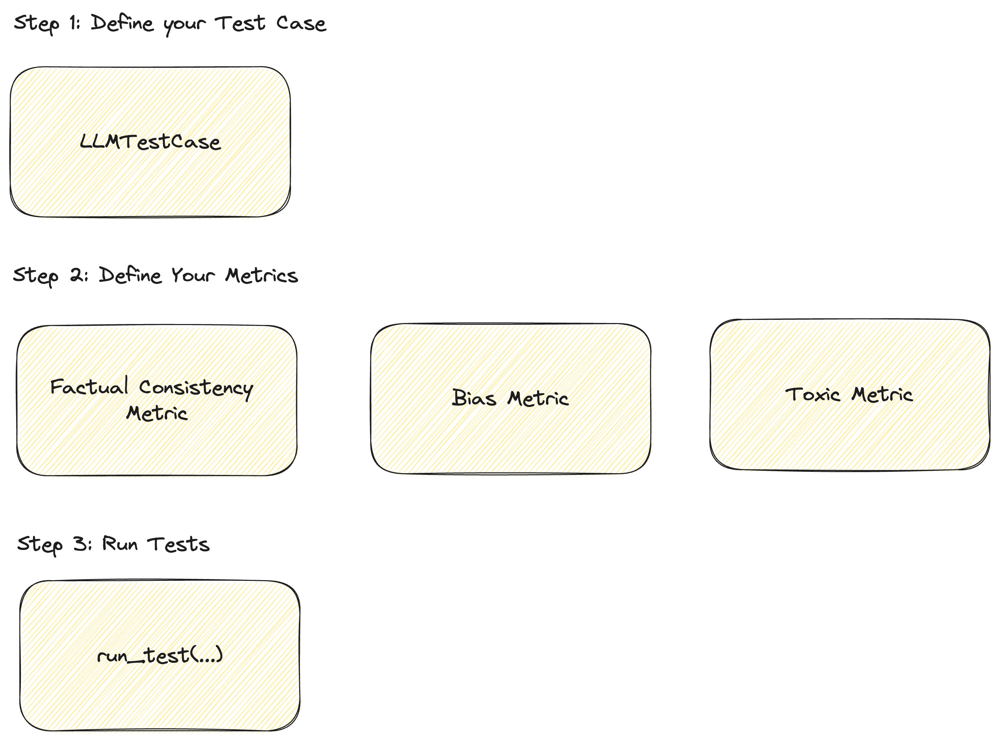

# Write a simple test case

To write a test case takes less than 5 minutes and can be done in just a few lines of code.



You can write a simple test case as simply as:

```bash
deepeval test generate test_sample.py
```

```python
import os
import openai
from deepeval.metrics.factual_consistency import FactualConsistencyMetric
from deepeval.run_test import assert_test
from deepeval.test_case import LLMTestCase

openai.api_key = "sk-XXX"

# Write a sample ChatGPT function
def generate_chatgpt_output(query: str):
    response = openai.ChatCompletion.create(
        model="gpt-3.5-turbo",
        messages=[
            {"role": "system", "content": "You are a helpful assistant."},
            {"role": "assistant", "content": "The customer success phone line is 1200-231-231 and the customer success state is in Austin."},
            {"role": "user", "content": query}
        ]
    )
    llm_output = response.choices[0].message.content
    return llm_output

def test_factual_consistency():
    query = "What is the customer success phone line?"
    context = "Our customer success phone line is 1200-231-231."
    output = generate_chatgpt_output(query)
    metric = FactualConsistencyMetric()
    test_case = LLMTestCase(query=query, context=context, output=output)
    assert_test(test_case, metrics=[metric])

```
After writing this test, just run: 

```bash
deepeval test run sample.py
# If you want to stay with pytest instead
```

## LLMTestCase

We can broke down how to write this test and what exactly goes into an `LLMTestCase`:

Explanation of variables:
- `query`: The input query for the ChatGPT model.
- `context`: The context or conversation history for the ChatGPT model.
- `output`: The generated output response from the ChatGPT model.
- `expected_output`: The expected output response for the given input query and context.

## Running a Test

### `run_test` 

`run_test` allows you to run a test based on the metrics provided with a given number of retries and minimum successes.

You can run it with 1 or multiple test case and metrics.
```python
from deepeval.metrics.factual_consistency import FactualConsistencyMetric
from deepeval.metrics.answer_relevancy import AnswerRelevancyMetric

metric_1 = FactualConsistencyMetric()
metric_2 = AnswerRelevancyMetric()
run_test(test_case, [metric_1, metric_2])
```

### `assert_test`

`assert_test` is a wrapper on top of `run_test` and can be used for enforcing errors and to maintain similar logic as other tests.

```python
assert_test(test_case, [metric_1])
```
